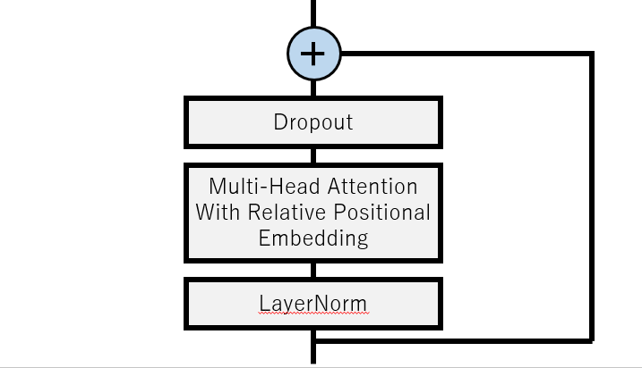

# Conformer implementation with Pytorch
This is a NON-OFFICIAL Pytorch implementation of Conformer.

You can use this block to build your own great model!!

Reference : [Conformer: Convolution-augmented Transformer for Speech Recognition](https://arxiv.org/abs/2005.08100)


## Model Architecture

- Total flow of the Conformer Block

  

  

- Feed Forward Module

  

  

- Multi-Head Self Attention Module

  

  

- Convolution Module

  


## Requirements

This repository is tested on Ubuntu 20.04 LTS with the following environment.

- Python3.7+
- Cuda10.2
- CuDNN7+


## Setup

You can setup this repository with the following commands

```
cd tools
make
```

Please check if the `venv` directory is successfully located under the tools directory.


## Usage

You can use a Conformer block with the following codes.  

```
import torch
import json
from CF import get_conformer

conf = json.load(open('conformer.conf'))
net = get_conformer(**conf)
net.eval()

data = torch.randn(1, 32, conf['d_model'])
# data should be formatted as (B, L, D)
# B as batch-size, L as sequence-length, D as feature-dimension.

out = net(data)
```

The shape of output is (B, L, D).


Or you can use this block in the following way.

```
import torch
from CF import Conformer

net = Conformer(
	d_model=256,
	ff1_hsize=1024,
    ff1_dropout=0.2,
    n_head=4,
    mha_dropout=0.2,
    kernel_size=3,
    conv_dropout=0.2,
    ff2_hsize=1024,
    ff2_dropout=0.2
)
net.eval()

data = torch.randn(1, 32, 256)
out = net(data)
```


## References

- [Conformer: Convolution-augmented Transformer for Speech Recognition](https://arxiv.org/abs/2005.08100)

- [ESPNet; PR No.2144](https://github.com/espnet/espnet/pull/2144)
- [transformers; modeling_transfo_xl.py](https://github.com/huggingface/transformers/blob/master/src/transformers/modeling_transfo_xl.py)


## Author

Masao Someki ([@Masao-Someki](htps://github.com/Masao-Someki))

e-mail: `masao.someki@outlook.jp`